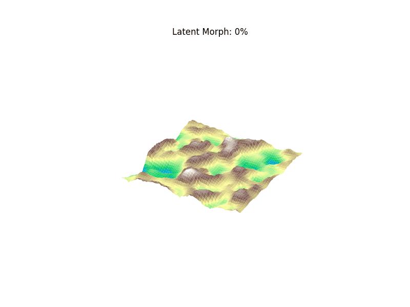

# Procedural Terrain VAE

A purely generative 3D topography engine built from scratch in PyTorch. This project utilizes a Convolutional Variational Autoencoder (VAE) to compress mathematically generated landscapes into a continuous probabilistic latent space, allowing for the seamless 3D interpolation of synthetic geography.

## Architecture Overview
* **The Data Pipeline:** Bypasses static disk I/O by utilizing CPU-parallelized procedural generation (`scipy.ndimage.gaussian_filter` & `joblib`) to hallucinate thousands of unique 64x64 terrain grids directly in RAM.
* **The Probabilistic Encoder:** A 3-block 2D Convolutional neural network that maps spatial topography into a 32-dimensional Gaussian probability distribution ($\mu$ and $\sigma$).
* **The Reparameterization Trick:** Enables backpropagation through the stochastic sampling bottleneck layer, ensuring continuous latent space topology.
* **The Dual-Objective Loss:** Balances topological accuracy using pixel-wise Binary Cross-Entropy (Reconstruction Loss) with latent space smoothness using Kullback-Leibler (KL) Divergence.

## Key Features
* **In-Memory Generation:** Zero dataset download required; generates 5,000+ training samples dynamically.
* **CPU Optimized:** Explicit PyTorch thread manipulation to maximize multi-core compute environments.
* **Seamless Latent Interpolation:** Samples two random vectors in the latent space and linearly interpolates between them, decoding the steps into a fully 3D rendered Matplotlib animation of mountains physically morphing into oceans.

## Tech Stack
* **Deep Learning:** PyTorch (`nn.Module`, `Conv2d`, `ConvTranspose2d`)
* **Data Processing:** NumPy, SciPy, Joblib (Multi-processing)
* **Visualization:** Matplotlib (3D Axis, PillowWriter)

## Repository Structure
* `terrain_hd_vae.ipynb`: The complete, self-contained architecture, training loop, and rendering engine.
